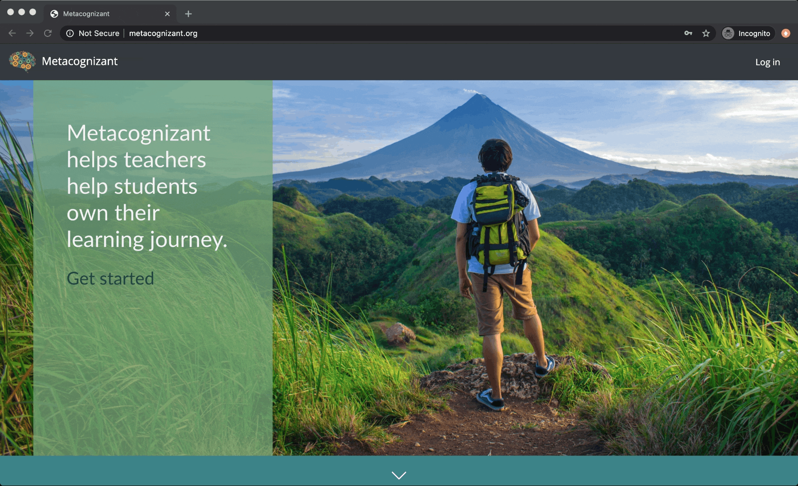
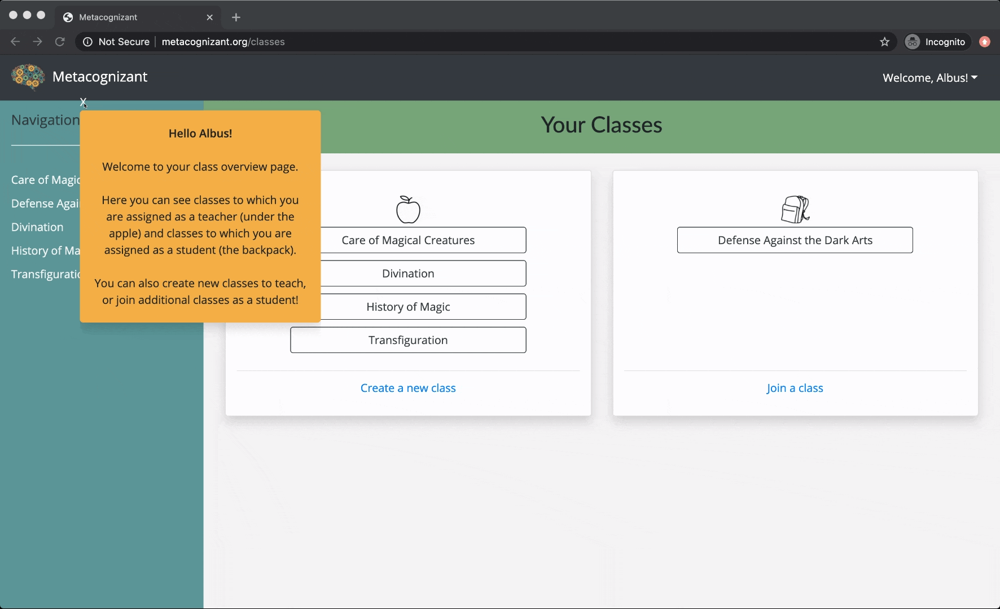
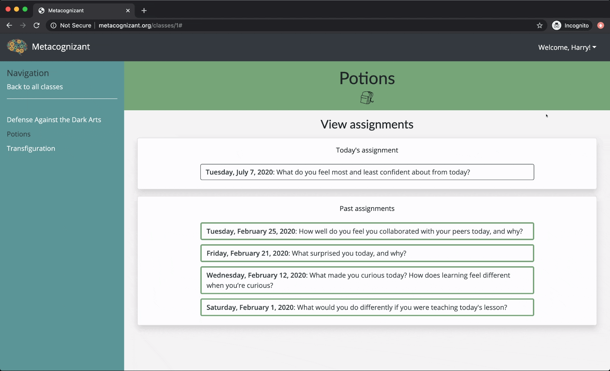
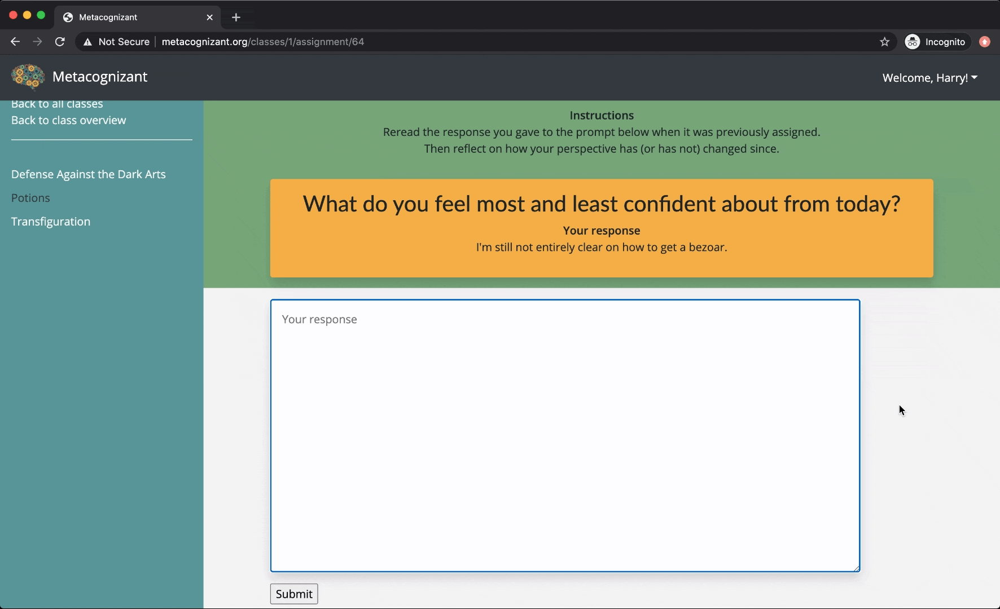
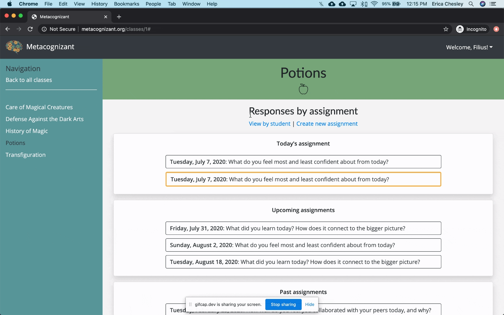

[](http://metacognizant.org) 
# Metacognizant

## Overview

```“We don’t learn from experience. We learn from reflecting on experience.” - John Dewey```

Research shows that when students have the opportunity and tools to actively reflect on their learning, it allows them to take greater ownership of their process, build confidence as students, and ultimately improve academic performance. Metacognizant is an educational technology tool built to encourage and facilitate daily reflection practices in the secondary school classroom.

A client-side rendering single-page app built with React.js and React Router, Metacognizant allows teachers to select from a carefully curated, research-based collection of reflection prompts (to which they can add their own) which can be quickly assigned by date and class section. Teachers can review student responses over time or by assignment, and can rapidly gauge overall sentiment with analysis provided by NLP API MonkeyLearn.

Users can sign up, and create and join classes all within the app if desired, or they can streamline set up with the ‘Login with Google’ option which automatically pulls class sections and membership from - and subsequently pushes assignments and responses to - Google Classroom so that students can continue to find all class assignments in one place.

## Tech Stack

**Frameworks & Libraries:** Python, JavaScript, React.js, Flask, PostgreSQL, SQLAlchemy, HTML, CSS, Bootstrap, Faker, Bcrypt, Luxon

**APIs:** Google Classroom, OAuth, MonkeyLearn

## Deployment

Visit Metacognizant online at <http://metacognizant.org>.

# 

## Features

#### Login
Users can create an account or sign in directly on the site. Alternatively, Google API and OAuth integration streamline setup by connecting with Google’s Learning Management System, Classroom, and automatically populating each user’s account with their associated classes. 



#### Classes
Users can take either a teacher or a student role for each of their classes, and can create additional classes to teach or join additional classes as a student. Instructional popup messages show on a user's first visit to each page, helping users take full advantage of Metacognizant’s capabilities.



#### Student View
Students can see and respond to prompts assigned by their teacher, with green highlighting indicating already submitted responses. 



In a revisit assignment, indicated in yellow, students see their own response to a previous assignment and are asked to reflect on how their perspective or experience has changed since writing. 



#### Teacher View
Within a given class, teachers can review student responses and assign future reflections. 

The ‘create new assignment’ form automatically populates with the class section a teacher is currently viewing but allows for assignment to any other sections they teach in the same step. All users are provided a list of research based reflection questions to choose from, but can also write their own which will remain available for future assignments.

Reflections assigned to a class associated with Google automatically get pushed to Classroom, and get marked completed as students submit responses in Metacognizant.



Color-coded sentiment analysis bars (generated with MonkeyLearn's text classification API) allow teachers to quickly gauge overall feelings in a class and identify students for whom a follow up check in may be helpful.


# 

## Installation

#### To run Metacognizant yourself...

Install PostgreSQL.

Clone [this repository].

Create and activate a virtual environment using Terminal.

```
$ virtualenv env
$ source env/bin/activate
```

Install requirements.
```
$ pip3 install -r requirements.txt
```

Set up a [Google developer credential]. Authorize localhost (or the address you want to run Metacognizant on). Download the credential file and save as `credentials.json`.

Get an API key from [MonkeyLearn].

Choose a pasword for your Metacognizant admin account and a secret key for your Flask server. 

Create a `secrets.sh` file and add the following (replacing each value with your own):
```
export MONKEYLEARN_KEY="YOUR_MONKEY_LEARN_API_KEY"
export ADMIN_PASSWORD="YOUR_METACOGNIZANT_ADMIN_PASSWORD"
export APP_SECRET_KEY="YOUR_FLASK_APP_SECRET_KEY"
```
Source your keys into the environment.
```
$ source secrets.sh
```
Seed your database.
```
$ python3 seed_database.py
```
Start your server.
```
$ python3 server.py
```

Now you can visit metacognizant at `localhost:5000`! Your admin password and admin@metacognizant.org will give you 


[this repository]: https://github.com/ericachesley/metacognizant.git
[Google developer credential]: https://console.developers.google.com/apis/credentials
[MonkeyLearn]: https://monkeylearn.com/